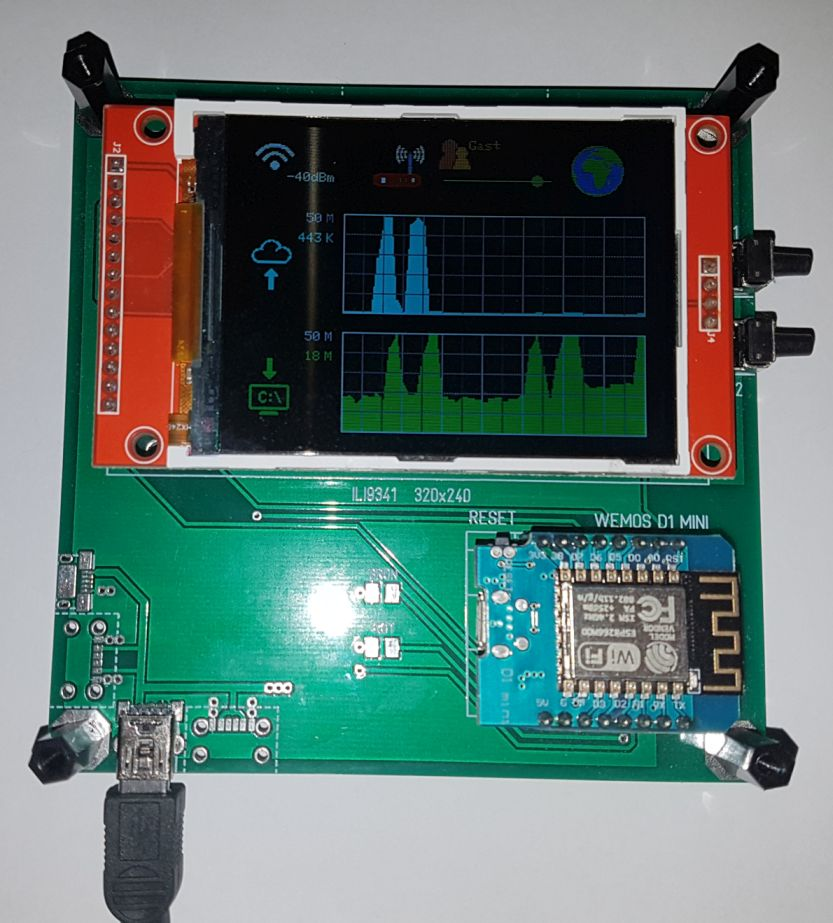
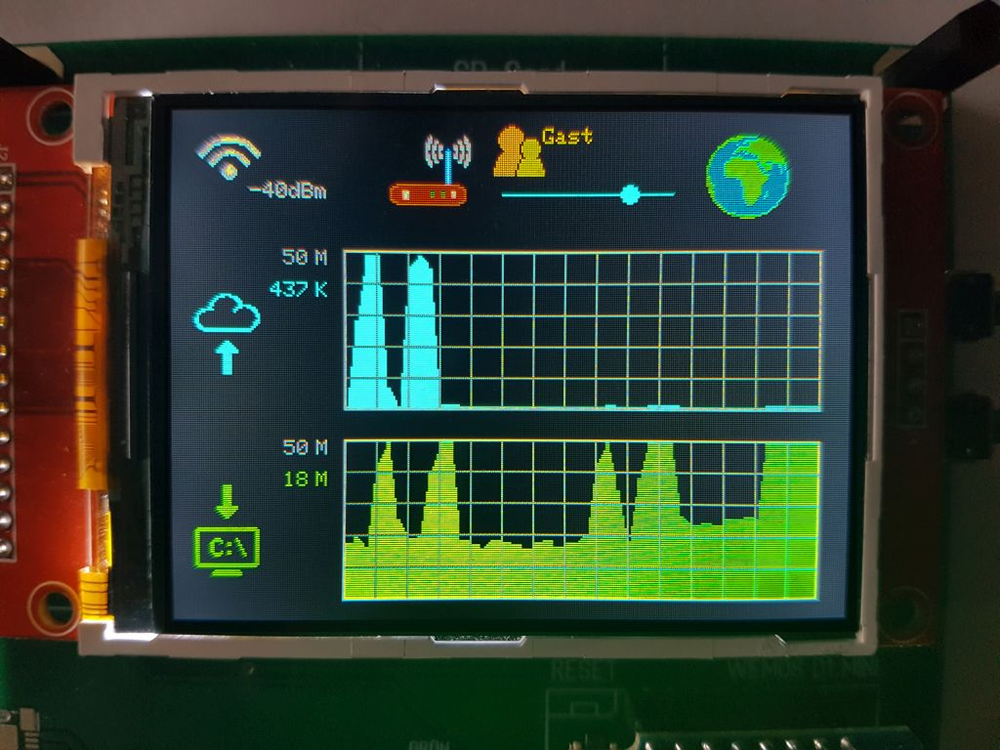

# WebMonitor
 Änderungen by zeroTM 
 Datum: 06/2024 
   
   Änderungen:  
   -- Adafruit ILI9341 
   ++ TFT_eSPI Bibliothek (mehrere Displays unterstützt!) 
   -- ILI9341_Graphic.h (class komplett entfernt) 
   -- ILI9341_Graphic.cpp (void-Funktionen in WebMonitor_1.ino eingefügt) 
    
    
   In planung: 
   ** auf Platformio wechseln 
   ** ESP32 unterstützung 
   ** Konfiguration erweitern(Einstellungen editierbar machen, Einstellungen erweitern) 
   ** Touchscreen unterstützung 
   ** Router Statistik 
   ** Call-Monitor 
    
   
## Motivation
Im ersten Covid-19 Lockdown 2020 in Deutschland hatte ich einen sehr langsamen Internetzugang und war zeitweilig im Home-Office.
Bei Problemen in Videokonferenzen wollte ich der Ursache auf den Grund gehen und wissen wie die aktuelle Netzwerklast zum Internet war.
Zwar hatte mein derzeitiger Router, eine Fritz!Box 7490, eine Übersicht darüber auf einer internen Website aber ich wollte die Informationen unabhängig vom Browser angezeigt bekommen.
Die Idee war es einen ESP8266 Controller per WLAN an den Router zu koppeln und die benötigten Informationen per TR-064 Protokoll auszulesen.
Daraus ist dieses kleine Hard- und Softwareprojekt hervorgegangen.
 
***Es wurde mit den Routermodellen Fritz!Box 7490, Fritz!Box 7530, Fritz!Box 7560 und Fritz!Box 7590, sollte aber auch mit anderen Modellen funktionieren.***
 
*Hinweis: "Fritz!Box" ist ein Markenname der Firma AVM GmbH in Berlin*
 
 

In the first Covid-19 lockdown 2020 in Germany, I had a very slow Internet access and was temporarily in the home office.
With problems in video conferences, I wanted to know the root of the cause and know what the current network load to the Internet was.
Although my current router, a Fritz!Box 7490, had an overview of this on an internal website, I wanted to have the information displayed independently of the browser.
The idea was to connect an ESP8266 controller via wifi to the router and read out the needed information via TR-064 protocol.
This tiny hardware and software project was the result.
 
***It was tested with the router models Fritz!Box 7490, Fritz!Box 7530, Fritz!Box 7560 and Fritz!Box 7590, but should also work with other models.***
 
*Notice: "Fritz!Box" is a brand name of the company AVM GmbH in Berlin*
 
 
 
 

 
 

## Ziele

* Überprüfung ob die Internetverbindung steht
* WLAN Verfügbarkeit
* Erkennung ob ein Gastzugang aktiv ist
* max. Upload Bandbreite
* aktuelle Upload Rate
* Upload Überblick der letzten Minuten
* max. Download Bandbreite
* aktuelle Download Rate
* Download Überblick der letzten Minuten

## Goals
* Check if the internet connection is up
* wifi availability
* detection if guest access is active
* max. upload bandwidth
* current upload rate
* Upload overview of the last minutes
* max. download bandwidth
* current download rate
* download overview of the last minutes
 

