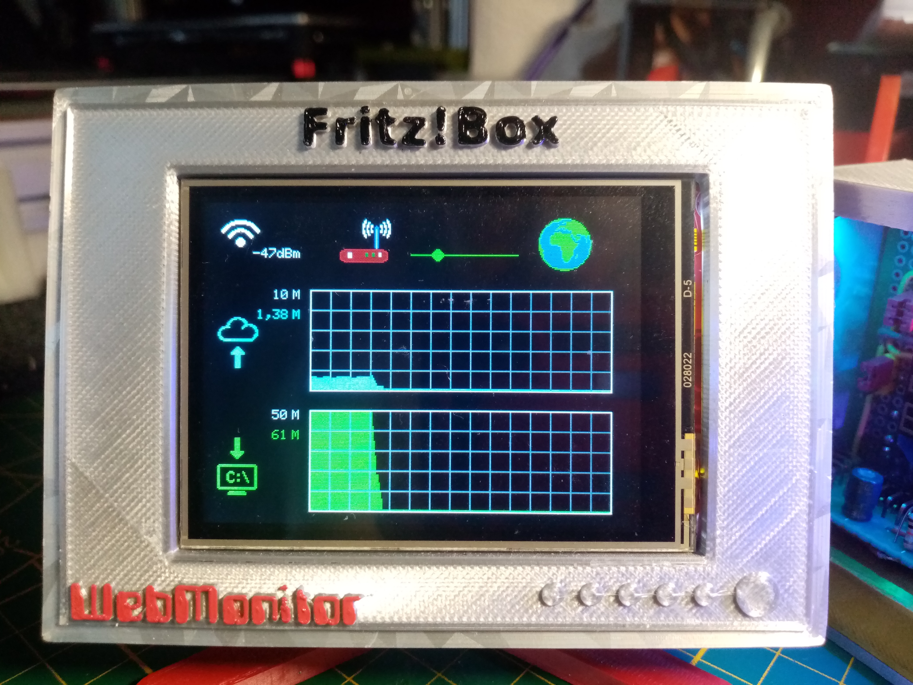
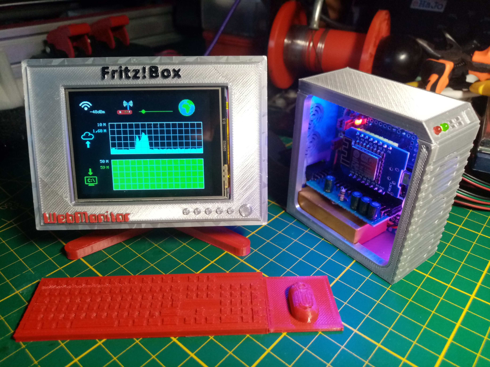
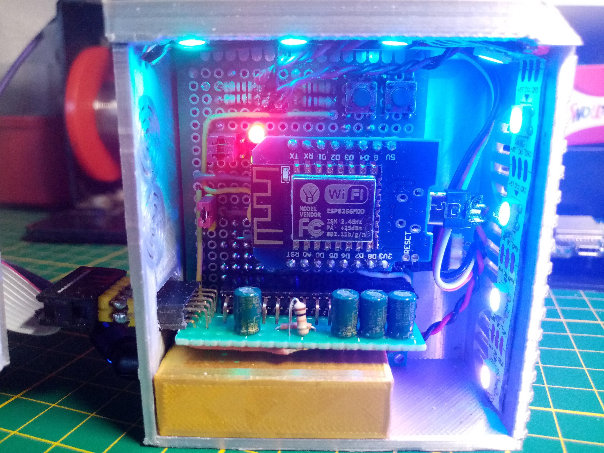

# WebMonitor
Original Code von:   
 * Autor: Jörg Bernhardt 
 * Datum: 11/2020 
 * Source: https://github.com/Joerg-66/ESP8266-WebMonitor 
 
 Änderungen by zeroTM 
 
# Version: 1.3+z1.1
 Datum: 30/06/2024 
  
   Änderungen
   ++ FastLED Library (3.7.0)  
   ++ 8 WS2812b Leds 
      Pin4[SD_CS] genutzt (leitung getrennt und Jumper hinzugefügt) 
   ++ Grüne LED als Power/Boot Indicator (Boot: blinkend, Internet erkannt: on, Internet getrennt: blinkend) 
      Pin0[T_CS] genutzt (leitung getrennt und Jumper hinzugefügt) 
   ++ Rote LED als TR064-Kommunikations Indicator (bei TR064 aufrufen blinkend) 
      Pin16[T_IRQ] genutzt (leitung getrennt und Jumper hinzugefügt) 
     

# Version: 1.3+z1 
 Datum: 06/2024 
   
   Änderungen:   
   -- Adafruit ILI9341 
   ++ TFT_eSPI Bibliothek (mehrere Displays unterstützt!) 
   -- ILI9341_Graphic.h (class komplett entfernt) 
   -- ILI9341_Graphic.cpp (void-Funktionen in WebMonitor_1.ino eingefügt) 
    

## Die Entwicklungsumgebung
Lade und installiere von der Seite https://www.arduino.cc die Software Arduino (Version 1.8.15)  
  
Istalliere die folgenden Arduino Bibliotheken:  
* Adafruit GFX Library	(Version 1.10.10)  
* Adafruit BusIO	(Version 1.9.0)  
* Adafruit STMPE610	(Version 1.1.3)  
* FastLED Library 	(Version 3.7.0)  
  
Lade und installiere die TR-064 Bibliotheken von:  
* https://github.com/Aypac/Arduino-TR-064-SOAP-Library   (Version: 1.1.0 - Feb 2020)  
Diese Bibliothek ist eine großartige Arbeit von René Vollmer und übernimmt die TR-064 Kommunikation zum Router.  
Um diese Bibliothek nicht zu modifizieren, wurden die TR064_Query.h und TR064_Query.cpp als Zwischenschicht geschrieben.  
  
Lade und installiere die TFT_eSPI Bibliothek von:  
* https://github.com/Bodmer/TFT_eSPI (Version: master - Aktuell Jun 2024)  
Umfangreiche Bibliothek zum einfachen einbinden von vielen TFT-Displays - geschrieben von Bodmer  
** unter seine Github Repositories sind einige interessante und nützliche Bibliotheken zu finden  
** https://github.com/Bodmer?tab=repositories  
  
In der Arduino IDE unter "Voreinstellungen" im Feld "Zusätzliche Boardverwalter-URLs den folgenden Eintrag hinzufügen:  
* https://arduino.esp8266.com/stable/package_esp8266com_index.json  
  
Nun kann in der Arduino IDE über den Boardverwalter das "ESP Community" Packet installiert weden:  
* ESP8266 Community		(Version 2.7.4)  
***ACHTUNG! Aktuell muss das etwas ältere Paket wählen. Die Pakete Version 3.x.x verursachen einen Konflikt mit der TR-064-SOAP-Library.***  
  
Jetzt ist in der Arduino IDE das Board "LOLIN(WEMOS) D1 R2 & mini" verfügbar und kann ausgewählt werden.  
Alle Werte behalten die Default Werte. Die Flash Size ist "4MB (FS:2MB OTA:~1019KB)"  
  
Jetzt kann das Verzeichnis "WebMonitor_1" (siehe oben auf der Website) inklusive aller enthaltenen Dateien auf den lokalen Rechner kopiert werden.  
Verbindet man nun den PC über ein Micro-USB Kabel mit dem ESP8266, kann der Quellcode kompiliert und in den Mikrocontroller geschrieben werden.  
  
 

## Quellcode
Das Hauptprogramm befindet sich in der Arduino Datei "WebMonitor_1.ino"  
Die Dateien "ESP_Settings.h" und "ESP_Settings.cpp" stellen die ESP8266 Website dar und steuern die Konfiguration im ESP8266 internen EEPROM.  
Die Dateien "TR064_Query.h" und "TR064_Query.cpp" beinhalten die Kommunikationsroutinen zur Steuerung der Bibliothek "TR-064-SOAP-Library".  
  
Im Quellcode gibt es die Schwierigkeit, dass im Arduino Compiler die TR-064 Instanz erstellt werden muss bevor die Einstellungen aus dem EEPROM ausgelesen werden können.  
Deshalb wird zu Beginn eine Default-Instanz gebildet:  
* TR064_Query TR_064 = TR064_Query(49000, "192.168.178.254", "admin", "");  
  
Zur Laufzeit wird die Instanz gelöscht...   
* TR_064.~TR064_Query();  
  
... und mit den EEPROM Daten wieder neu instanziert:  
* new(&TR_064) TR064_Query(49000, sRouterIP, sTR064_User, sTR064_Password);  
  
Dies funktioniert leider nicht unter VS-Code unter PlatformIO. Hier ist mir noch keine Lösung gelungen.  
  
 

## Funktion  
Der LCD Monitor zeigt die Verbindung zum WLAN vom Router und die Internet Verbindung an.  
Ein wandernder Punkt zeigt dabei an, dass die Kommunikation zum Router läuft und sich nicht aufgehängt hat.  
Bei Problemen wird der Teil der nicht erreichbar ist grau und ein Blitz-Symbol zeigt den vermuteten Ort des Problems an.  
Wenn ein Gastzugang geöffnet ist, wird neben dem Router ein Symbol mit zwei symbolisierten Personen angezeigt.  
Es gibt zwei Gitternetze, die den Upload (oben - Cyan) und Download (unten - Grün) grafisch über den Zeitverlauf (nicht justiert) anzeigen.  
Die Werte rechts neben den Gitternetze zeigen je nach Konfiguration die maximale eingestellte oder maximale reale Bandbreite.  
Zusätzlich wird die aktuelle Up- bzw. Download- Geschwindigkeit angezeigt.  
  
Die Funtion wurde mit den Routermodellen Fritz!Box 7490, Fritz!Box 7530, Fritz!Box 7560 und Fritz!Box 7590 der Firma AVM getestet.  
Es sollten aber auch weitere Modelle des Herstellers funktionieren.  
 
*Hinweis: "Fritz!Box" ist ein Markenname der Firma AVM GmbH in Berlin*
 
  
  
 
  
### *Zu den Einstellungen der Nutzerdaten und in der Fritz!Box siehe Verzeichnis "Quick and Easy"*  

## Ziele

* Überprüfung ob die Internetverbindung steht
* WLAN Verfügbarkeit
* Erkennung ob ein Gastzugang aktiv ist
* max. Upload Bandbreite
* aktuelle Upload Rate
* Upload Überblick der letzten Minuten
* max. Download Bandbreite
* aktuelle Download Rate
* Download Überblick der letzten Minuten

# todo...

* auf Platformio wechseln 
* ESP32 unterstützung 
* Konfiguration erweitern(Einstellungen editierbar machen, Einstellungen erweitern) 
* Touchscreen unterstützung (Pins derzeit genutzt für LEDs) 
* Router Statistik 
* Call-Monitor 
 

 
 

