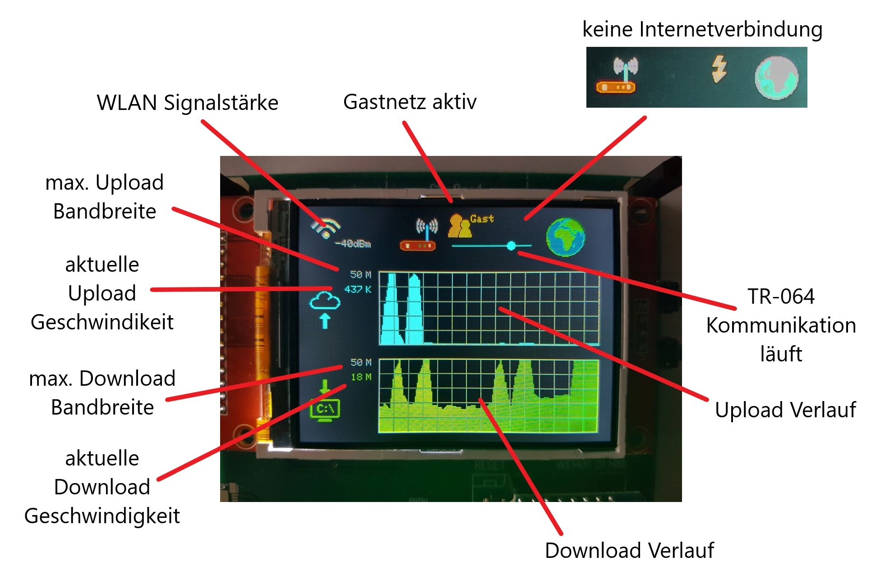

# Software
Original Code von:   
 * Autor: Jörg Bernhardt 
 * Datum: 11/2020 
 * Source: https://github.com/Joerg-66/ESP8266-WebMonitor 
 
 Änderungen by zeroTM 
 Datum: 06/2024 
   
   Änderungen:   
   -- Adafruit ILI9341 
   ++ TFT_eSPI Bibliothek (mehrere Displays unterstützt!) 
   -- ILI9341_Graphic.h (class komplett entfernt) 
   -- ILI9341_Graphic.cpp (void-Funktionen in WebMonitor_1.ino eingefügt) 
    
    
   In planung: 
   ** auf Platformio wechseln 
   ** ESP32 unterstützung 
   ** Konfiguration erweitern(Einstellungen editierbar machen, Einstellungen erweitern) 
   ** Touchscreen unterstützung 
   ** Router Statistik 
   ** Call-Monitor 
    

## Die Entwicklungsumgebung
Lade und installiere von der Seite https://www.arduino.cc die Software Arduino (Version 1.8.15)  
  
Istalliere die folgenden Arduino Bibliotheken:  
* Adafruit GFX Library	(Version 1.10.10)  
* Adafruit BusIO			(Version 1.9.0)  
* Adafruit STMPE610		(Version 1.1.3)  
  
Lade und installiere die TR-064 Bibliotheken von:  
* https://github.com/Aypac/Arduino-TR-064-SOAP-Library   (Version: 1.1.0 - Feb 2020)  
Diese Bibliothek ist eine großartige Arbeit von René Vollmer und übernimmt die TR-064 Kommunikation zum Router.  
Um diese Bibliothek nicht zu modifizieren, wurden die TR064_Query.h und TR064_Query.cpp als Zwischenschicht geschrieben.  
  
Lade und installiere die TFT_eSPI Bibliothek von:  
* https://github.com/Bodmer/TFT_eSPI (Version: master - Aktuell Jun 2024)  
Umfangreiche Bibliothek zum einfachen einbinden von vielen TFT-Displays - geschrieben von Bodmer  
** unter seine Github Repositories sind einige interessante und nützliche Bibliotheken zu finden  
** https://github.com/Bodmer?tab=repositories  
  
In der Arduino IDE unter "Voreinstellungen" im Feld "Zusätzliche Boardverwalter-URLs den folgenden Eintrag hinzufügen:  
* https://arduino.esp8266.com/stable/package_esp8266com_index.json  
  
Nun kann in der Arduino IDE über den Boardverwalter das "ESP Community" Packet installiert weden:  
ESP8266 Community		(Version 2.7.4)  
***ACHTUNG! Aktuell muss das etwas ältere Paket wählen. Die Pakete Version 3.x.x verursachen einen Konflikt mit der TR-064-SOAP-Library.***  
  
Jetzt ist in der Arduino IDE das Board "LOLIN(WEMOS) D1 R2 & mini" verfügbar und kann ausgewählt werden.  
Alle Werte behalten die Default Werte. Die Flash Size ist "4MB (FS:2MB OTA:~1019KB)"  
  
Jetzt kann das Verzeichnis "WebMonitor_1" (siehe oben auf der Website) inklusive aller enthaltenen Dateien auf den lokalen Rechner kopiert werden.  
Verbindet man nun den PC über ein Micro-USB Kabel mit dem ESP8266, kann der Quellcode kompiliert und in den Mikrocontroller geschrieben werden.  
  
 

## Quellcode
Das Hauptprogramm befindet sich in der Arduino Datei "WebMonitor_1.ino"  
Die Dateien "ESP_Settings.h" und "ESP_Settings.cpp" stellen die ESP8266 Website dar und steuern die Konfiguration im ESP8266 internen EEPROM.  
Die Dateien "TR064_Query.h" und "TR064_Query.cpp" beinhalten die Kommunikationsroutinen zur Steuerung der Bibliothek "TR-064-SOAP-Library".  
  
Im Quellcode gibt es die Schwierigkeit, dass im Arduino Compiler die TR-064 Instanz erstellt werden muss bevor die Einstellungen aus dem EEPROM ausgelesen werden können.  
Deshalb wird zu Beginn eine Default-Instanz gebildet:  
* TR064_Query TR_064 = TR064_Query(49000, "192.168.178.254", "admin", "");  
  
Zur Laufzeit wird die Instanz gelöscht...   
* TR_064.~TR064_Query();  
  
... und mit den EEPROM Daten wieder neu instanziert:  
* new(&TR_064) TR064_Query(49000, sRouterIP, sTR064_User, sTR064_Password);  
  
Dies funktioniert leider nicht unter VS-Code unter PlatformIO. Hier ist mir noch keine Lösung gelungen.  
  
 

## Funktion  
Der LCD Monitor zeigt die Verbindung zum WLAN vom Router und die Internet Verbindung an.  
Ein wandernder Punkt zeigt dabei an, dass die Kommunikation zum Router läuft und sich nicht aufgehängt hat.  
Bei Problemen wird der Teil der nicht erreichbar ist grau und ein Blitz-Symbol zeigt den vermuteten Ort des Problems an.  
Wenn ein Gastzugang geöffnet ist, wird neben dem Router ein Symbol mit zwei symbolisierten Personen angezeigt.  
Es gibt zwei Gitternetze, die den Upload (oben - Cyan) und Download (unten - Grün) grafisch über den Zeitverlauf (nicht justiert) anzeigen.  
Die Werte rechts neben den Gitternetze zeigen je nach Konfiguration die maximale eingestellte oder maximale reale Bandbreite.  
Zusätzlich wird die aktuelle Up- bzw. Download- Geschwindigkeit angezeigt.  
  
Die Funtion wurde mit den Routermodellen Fritz!Box 7490, Fritz!Box 7530, Fritz!Box 7560 und Fritz!Box 7590 der Firma AVM getestet.  
Es sollten aber auch weitere Modelle des Herstellers funktionieren.  
  
 

  
 
  
### *Zu den Einstellungen der Nutzerdaten und in der Fritz!Box siehe Verzeichnis "Quick and Easy"*  

 
 
=======================================================================================
 
 

## The development environment
Download and install the Arduino software (version 1.8.15) from https://www.arduino.cc.  
  
Install the following Arduino libraries:  
* Adafruit GFX Library	(Version 1.10.10)  
* Adafruit BusIO			(Version 1.9.0)  
* Adafruit STMPE610		(Version 1.1.3)  
  
Download and install the TR-064 libraries from:  
* https://github.com/Aypac/Arduino-TR-064-SOAP-Library (version: 1.1.0 - Feb 2020).  
This library is a great work by René Vollmer and handles the TR-064 communication to the router.  
To avoid modifying this library, TR064_Query.h and TR064_Query.cpp were written as an intermediate layer.  
  
Download and install the TFT_eSPI libraries from:  
* https://github.com/Bodmer/TFT_eSPI (version: master - Jun 2024)  
Comprehensive library for easy integration of many TFT displays - written by Bodmer  
** some interesting and useful libraries can be found in his Github repositories  
** https://github.com/Bodmer?tab=repositories  
  
In the Arduino IDE under "Preferences" in the field "Additional board manager URLs add the following entry:  
* https://arduino.esp8266.com/stable/package_esp8266com_index.json  
  
Now you can install the "ESP Community" package in the Arduino IDE via the board manager:  
ESP8266 Community (Version 2.7.4)  
***ATTENTION: Currently you have to choose the older package. The packages version 3.x.x cause a conflict with the TR-064-SOAP-Library.***  
  
Now the board "LOLIN(WEMOS) D1 R2 & mini" is available in the Arduino IDE and can be selected.  
All values keep the default values. The Flash Size is "4MB (FS:2MB OTA:~1019KB)".  
  
Now the directory "WebMonitor_1" (see above on the website) including all contained files can be copied to the local computer.  
If you now connect the PC to the ESP8266 via a micro USB cable, the source code can be compiled and written to the microcontroller.  
  
 

## Source code
The main program is located in the Arduino file "WebMonitor_1.ino".  
The files "ESP_Settings.h" and "ESP_Settings.cpp" represent the ESP8266 website and control the configuration in the ESP8266 internal EEPROM.  
The files "TR064_Query.h" and "TR064_Query.cpp" contain the communication routines to control the library "TR-064-SOAP-Library".  
  
In the source code there is the difficulty that in the Arduino compiler the TR-064 instance must be created before the settings can be read from the EEPROM.  
Therefore a default instance is created at the beginning:  
* TR064_Query TR_064 = TR064_Query(49000, "192.168.178.254", "admin", "");  
  
At runtime, the instance is deleted....  
* TR_064.~TR064_Query();  
  
... and re-instantiated with the EEPROM data:  
* new(&TR_064) TR064_Query(49000, sRouterIP, sTR064_User, sTR064_Password);  
  
Unfortunately this does not work under VS-Code under PlatformIO. I have not yet managed to find a solution here.  
  
 

## Function
The LCD monitor shows the connection to the wifi of the router and the Internet connection.  
A moving dot indicates that the communication to the router is running and has not hung up.  
In case of problems, the part that is unreachable turns gray and a lightning icon indicates the suspected location of the problem.  
When a guest access is open, an icon with two symbolized people is displayed next to the router.  
There are two grids showing upload (top - cyan) and download (bottom - green) graphically over time (not adjusted).  
The values to the right of the grids show the maximum adjusted or maximum real bandwidth, depending on the configuration.  
In addition, the current upload or download speed is displayed.  
  
The function was tested with the router models Fritz!Box 7490, Fritz!Box 7530, Fritz!Box 7560 and Fritz!Box 7590 from the company AVM.  
However, other models from the manufacturer should also work.  
  
 

 

### *For the settings of the user data and in the Fritz!Box, see directory "Quick and Easy"*  
